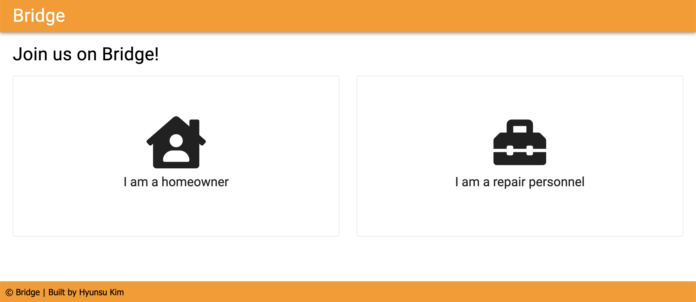
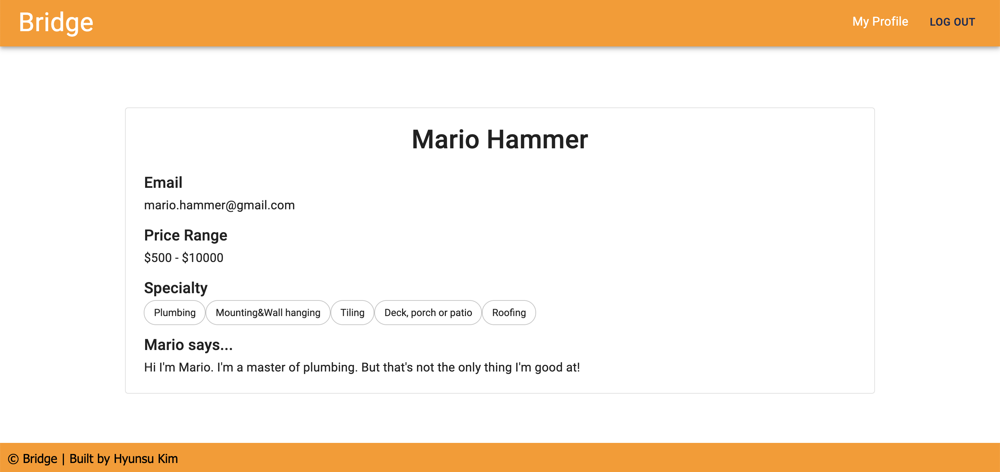

# Bridge

## Description

_Duration: 2 Week Sprint_

Have you ever thought about buying a house? Have you thought about what you would do when your house needs some work? or maybe you already own a house. Have you ever been in a situation where you need to find a repair personnel for your house but having a hard time finding one that you like? When I pictured myself owning a house, finding a repair personnel for the house was the biggest challenge that came to my mind.
Also, when I was an aircraft mechanic, some of my coworkers fixed houses for their side hustle. But I felt like there is no good platform for them to promote themselves. So I decided to build this application called Bridge.

To see the fully functional site deployed on heroku, please visit: [Bridge](https://afternoon-chamber-15478.herokuapp.com/#/home)

\*Recommend to adjust the zoom setting of the browser to 125% for the best optimized view

## Screen Shot






### Prerequisites

- [Node.js](https://nodejs.org/en/)
- [PostgreSQL](https://www.postgresql.org/)
- [Nodemon](https://nodemon.io/)
- [OpenCage API Key](https://opencagedata.com/)
- [Mapbox API Key](https://www.mapbox.com/)

## Installation

1. Create a database named `bridge`,
2. The queries in the `database.sql` file are set up to create all the necessary tables and populate the needed data to allow the application to run correctly. The project is built on [Postgres](https://www.postgresql.org/download/), so you will need to make sure to have that installed. We recommend using Postico to run those queries as that was used to create the queries,
3. Open up your editor of choice and run an `npm install`
4. Create a `.env` file at the root of the project and paste this line into the file:
   ```
   SERVER_SESSION_SECRET=superDuperSecret
   ```
   While you're in your new `.env` file, take the time to replace `superDuperSecret` with some long random string like `25POUbVtx6RKVNWszd9ERB9Bb6` to keep your application secure. Here's a site that can help you: [https://passwordsgenerator.net/](https://passwordsgenerator.net/). If you don't do this step, create a secret with less than eight characters, or leave it as `superDuperSecret`, you will get a warning.
5. Add your OpenCage API key to .env file as `REACT_APP_OPEN_CAGE`
6. Add your Mapbox API key to .env file as `REACT_APP_MAPBOX_TOKEN`
7. Run `npm run server` in your terminal
8. Run `npm run client` in your terminal
9. The `npm run client` command will open up a new browser tab for you!

## Usage

This application has two types of users, homeowner user and repair personnel user.

### New user

1. A new user can create an account by clicking **Register** button.
2. The new user will select whether they are homeowner user or repair personnel user.
3. Depends on whether they are homeowner or repair personnel, they will be guided to an applicable registration page for them.
4. Once they finished registration, they will be automatically logged in and guided to the landing page.

### Homeowner user

1. Once a homeowner user is logged in, the user will see a map with pins that display the location of repair personnel. Once the user clicks a pin on the map, the repair personnel's name and link to the repair personnel's profile will be displayed around the clicked pin.
2. A list of repair personnel is located on the right side of the application. When the user clicks a repair personnel profile card, the user will be guided to the repair personnel's profile page.
3. The user can view their profile by clicking **My Profile** link on the top right.
4. On the **My Profile** page, the user has an option to edit their profile.

### Repair personnel user

1. Repair personnel users can view the map and the repair personnel list as homeowner users do which will allow the repair personnel user to check how their profiles are viewed on the application.
2. The user can view their profile by clicking **My Profile** link on the top right.
3. On the **My Profile** page, the user has an option to edit their profile. The user is able to update their information such as price range and specialties.

## Built With

React.js, Redux, Redux-Saga, Passport, JavaScript, Node.js, Express, PostgreSQL, Font Awesome, Material-ui, Mapbox, OpenCage, Google Font (A full list of dependencies can be found in `package.json`)

## License

[MIT](LICENSE.txt)

## Acknowledgement

Thanks to [Prime Digital Academy](www.primeacademy.io) in KCMO, especially my Ursus cohort mates and instructors, Myron and Scott

## Support

If you have suggestions or issues, please email me at [hyunsujk@gmail.com](hyunsujk@gmail.com)
