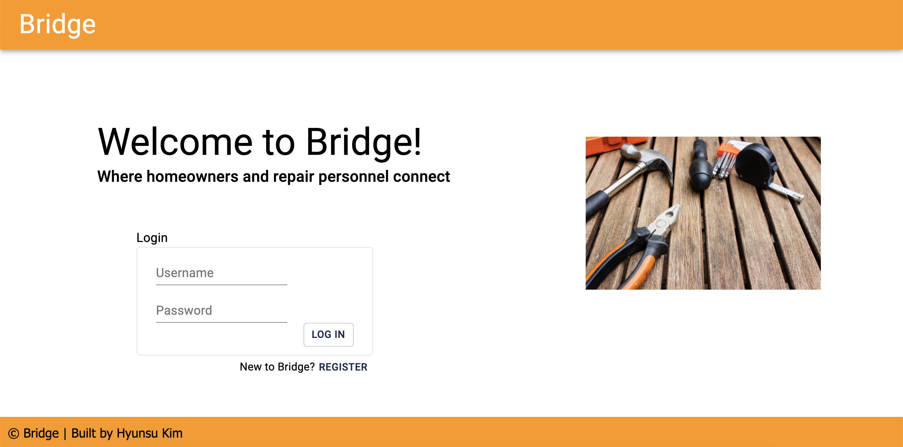
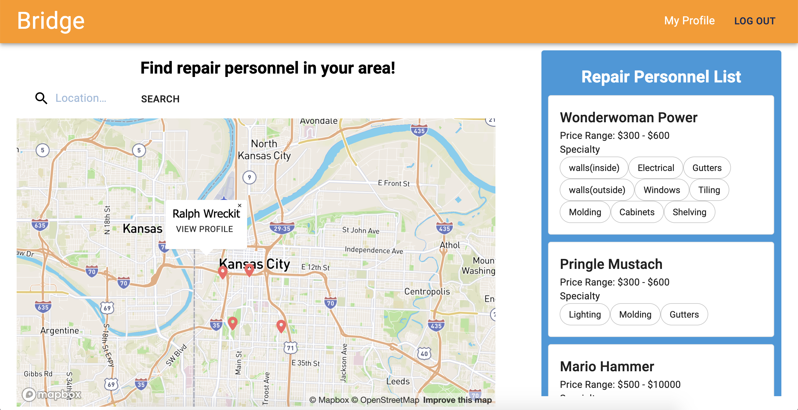

# Bridge

## Description

_Duration: 2 Week Sprint_

Have you ever thought about buying a house? Have you thought about what you would do when your house needs some work? or maybe you already own a house. Have you ever been in a situation where you need to find a repair personnel for your house but having a hard time finding one that you like? When I pictured myself owning a house, finding a repair personnel for the house was the biggest challenge that came to my mind.
Also, when I was an aircraft mechanic, some of my coworkers fixed houses for their side hustle. But I felt like there is no good platform for them to promote themselves. So I decided to build this application called Bridge.

To see the fully functional site deployed on heroku, please visit: [Bridge](https://afternoon-chamber-15478.herokuapp.com/#/home)

## Screen Shot

### Prerequisites

- [Node.js](https://nodejs.org/en/)
- [PostgreSQL](https://www.postgresql.org/)

## Installation

1. Create a database named `bridge`,
2. The queries in the `tables.sql` file are set up to create all the necessary tables and populate the needed data to allow the application to run correctly. The project is built on [Postgres](https://www.postgresql.org/download/), so you will need to make sure to have that installed. We recommend using Postico to run those queries as that was used to create the queries,
3. Open up your editor of choice and run an `npm install`
4. Add your OpenCage API key to .env file as `REACT_APP_OPEN_CAGE`
5. Add your Mapbox API key to .env file as `REACT_APP_MAPBOX_TOKEN`
6. Run `npm run server` in your terminal
7. Run `npm run client` in your terminal
8. The `npm run client` command will open up a new browser tab for you!

## Usage

New user

1. A new user can create an account by clicking **Register** button
2. The new user will select whether they are homeowner user or repair personnel user
3. Depends on whether they are homeowner or repair personnel, they will be guided to applicable registration page for them.
4. Once they finished registration, they will be automatically logged in and guided to landing page

Registered user

1. Whether the user is homeowner or repair personnel, once they are logged in, they will see a map with repair personnel pinned on it
2. on the right side, the user can view repair personnel in a list view
3. The user can view their profile by clicking **My Profile** link on top right
4. On the **My Profile** page, the user has an option to edit their profile

## Built With

React.js, Redux, Redux-Saga, Passport, JavaScript, Node.js, Express, PostgreSQL, Font Awesome, Material-ui, Mapbox, OpenCage, Google Font (A full list of dependencies can be found in `package.json`)

## License

[MIT](https://choosealicense.com/licenses/mit/)

## Acknowledgement

Thanks to [Prime Digital Academy](www.primeacademy.io) in KCMO, especially my Ursus Cohort mates and instructors, Myron and Scott

## Support

If you have suggestions or issues, please email me at [hyunsujk@gmail.com](hyunsujk@gmail.com)
